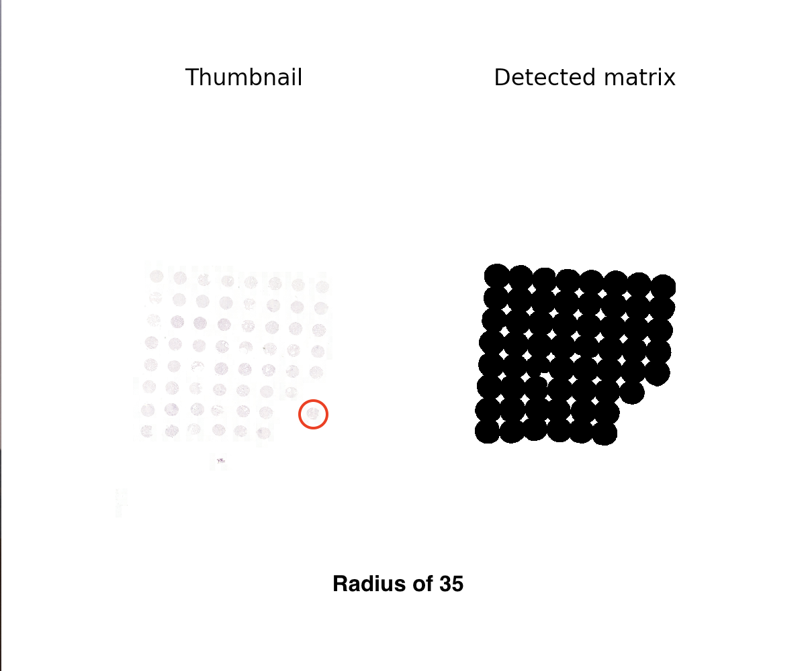
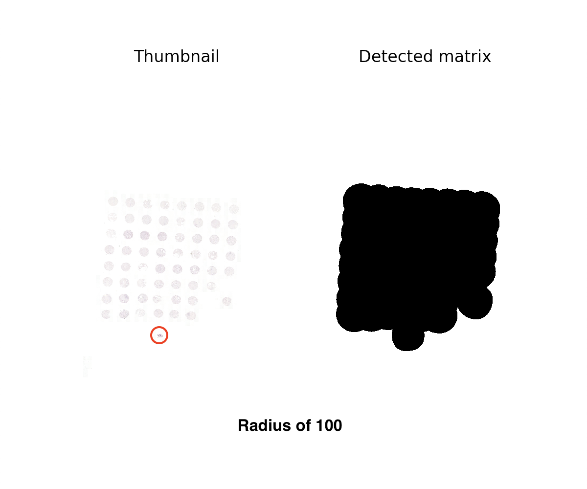
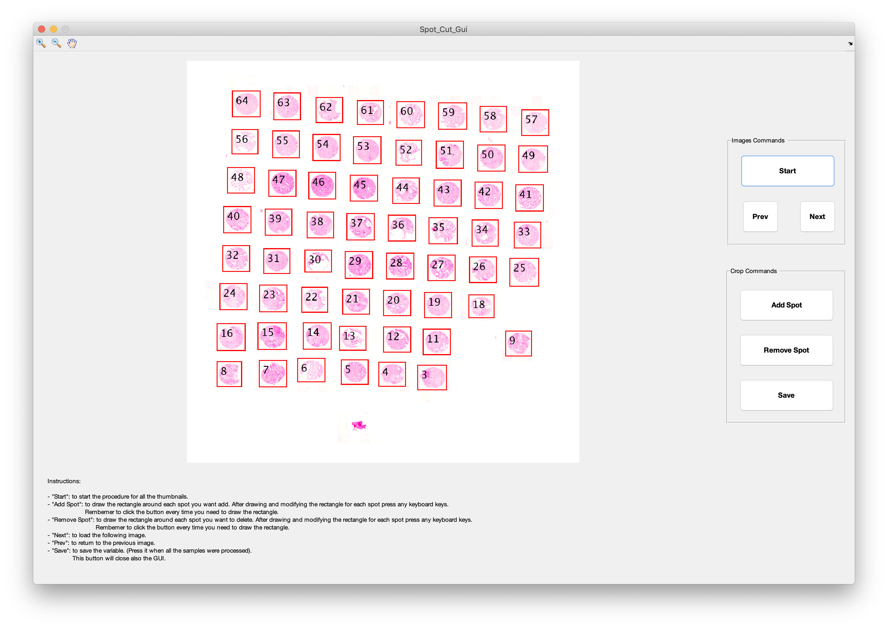

# HistoCrop

Cut ROI or TMA spots from mrxs-images!

## Getting Started

These instructions will get you a copy of the project up and running on your local machine for development and testing purposes. See deployment for notes on how to deploy the project on a live system.

### Prerequisites

What you need to install to get HistoCrop up and running:

* Matlab
* [MATLAB Engine API for Python](https://www.mathworks.com/help/matlab/matlab_external/get-started-with-matlab-engine-for-python.html)
  - Can be installed with the following commands at the matlab command prompt
  ```
  cd (fullfile(matlabroot,'extern','engines','python'))
  system('python setup.py install')
  ```
* Python3
  - openslide,os,sys,tkinter,texttable,cfonts,subprocess,csv,numpy,math,shutil,time

### Using the program

A step by step series of examples to show how to cut TMA spots out of multiple files.

Open terminal in the cropTMA folder and run `CropCode.py`.

```
cd /Users/jpohjone/Desktop/HistoCrop
python3 ./CropCode.py
```
```
██╗  ██╗ ██╗ ███████╗ ████████╗  ██████╗   ██████╗ ██████╗   ██████╗  ██████╗  
██║  ██║ ██║ ██╔════╝ ╚══██╔══╝ ██╔═══██╗ ██╔════╝ ██╔══██╗ ██╔═══██╗ ██╔══██╗
███████║ ██║ ███████╗    ██║    ██║   ██║ ██║      ██████╔╝ ██║   ██║ ██████╔╝
██╔══██║ ██║ ╚════██║    ██║    ██║   ██║ ██║      ██╔══██╗ ██║   ██║ ██╔═══╝  
██║  ██║ ██║ ███████║    ██║    ╚██████╔╝ ╚██████╗ ██║  ██║ ╚██████╔╝ ██║      
╚═╝  ╚═╝ ╚═╝ ╚══════╝    ╚═╝     ╚═════╝   ╚═════╝ ╚═╝  ╚═╝  ╚═════╝  ╚═╝      


Press R in case you want to crop a ROI from a WSIs
Press S in case you want to crop the Spots present in the TMAs
Press H in case you want to read the instructions:
```

Selecting `H` gives the help page, __which Valeria needs to update__.

Selecting `R` allows you to select a ROI from a whole slide image (WSI) and then cut it in sub-images.    

Selecting `S` allows you to extract TMA spots from a mrxs-file. Spots can be saved into patient specific folders with custom numbering if a suitable excel file is provided (specified later).

  1. After selecting `S` the program will ask for the `input` directory and an _empty_ `output` directory for the spots and summary-images.
  2. Next, the number of the rows and columns in the TMA spot matrix need to be specified. It does not matter if some of the TMA spot matrices have less rows or columns, select the maximum.
  3. [OPTIONAL] Give the folder of the excel files for patient ids and numbering. The excel file has some requirements, which stem from the standard excel outputted from some scanners.
       - __Numbering:__  Has to be specified in the _second_ sheet of the excel and match the dimensions given in the second part. All numbers must be present for spots that are actually present in the respective TMA image.
       - __Naming:__ Has to be speficied in the _third_ sheet of the excel and match the dimensions given in the second part. All spots that have the same name before an underscore (`patientID_*`) will be saved in the same folder under the respective folder for the whole TMA.
       - Name of each excel file must match the name of the mrxs-file.
  4. The program will output an image of the TMA spot matrix. If this matrix is detected in full select `Y`es. If some of the spots are not detected completely, the user has to give a new radius for the `strel()` command used in Matlab. Increasing the radius will select larger area and decreasing the radius will make the area smaller. An example can be seen below.





6. Wait for the spots to be saved!

## Explanation of the workflow

A more detailed explanation of the workflow can be aquired by reading trough the code and comments (do'h).

**Generate thumbnails from the mrxs-files (python)**
  1. Create folder for output files (eg. TurkuTMA_images).
  2. Save label, macro and thumbnail images of the mrxs file.
  3. Find out mrxs-image dimensions using openslide and divide image into matrix of small images.
  4. Save small images with coordinates in the name.


**Determine spot locations using the thumbnail image (matlab)**
  1. Load the thumbnail images generated with mrxs_convert.
  2. Detect spot matrix coordinates from thumbnail image and crop the thumbnail image.
  3. For each thumbnail image detect spot coordinates.
    1. Create mask of spots and extract boundingBoxes.
    2. Rotate boundingBox centroids so that the coordinates can be used to determine column and row for each spot.
    3. Use hierarchical clustering to cluster x and y coordinates and then give each spot an id from the bottom-right to upper left corner.
    4. Create a summaryImage by drawign boundingBoxes and ids to the thumbnail image.


**Allow modification of the boundingBoxes (matlab)**
  1. Show summary image to the user.
  2. Ask user to redraw any boundingBox. Click image to continue.
  3. ASk user to remove any boundingBox. Click image to continue.
  4. Repeat until all summaryImages have been shown.


**Cut out each TMA spot (matlab)**
  1. Replace/remove any user defined boundingBoxes.
  2. Create folder for all the spots (eg. TurkuTMA_spots)
  3. Create a new summaryImg and save to output folder.
  4. Reconstruct spot matrix area of the TMA image using the coordinates detected earlier.
  5. Create folder for the TMA being processed (eg. TurkuTMA_spots/TMA_1)
  6. Crop out each spot using the boundingBox coordinates.


## Built With

  * [Dropwizard](http://www.dropwizard.io/1.0.2/docs/) - The web framework used
  * [Maven](https://maven.apache.org/) - Dependency Management
  * [ROME](https://rometools.github.io/rome/) - Used to generate RSS Feeds

## Authors

* **Valeria Ariotta**
* **Joona Pohjonen**

## License

This project is licensed under the MIT License - see the [LICENSE.md](LICENSE.md) file for details

## Acknowledgments

* Hat tip to anyone whose code was used
