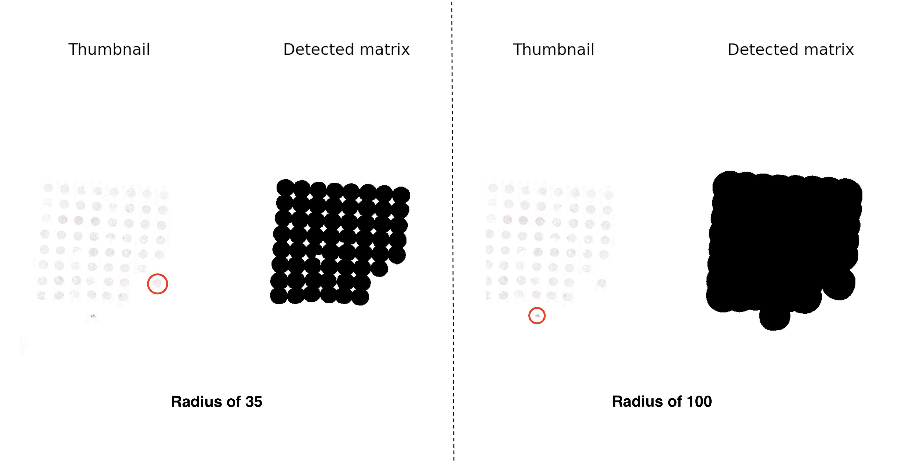
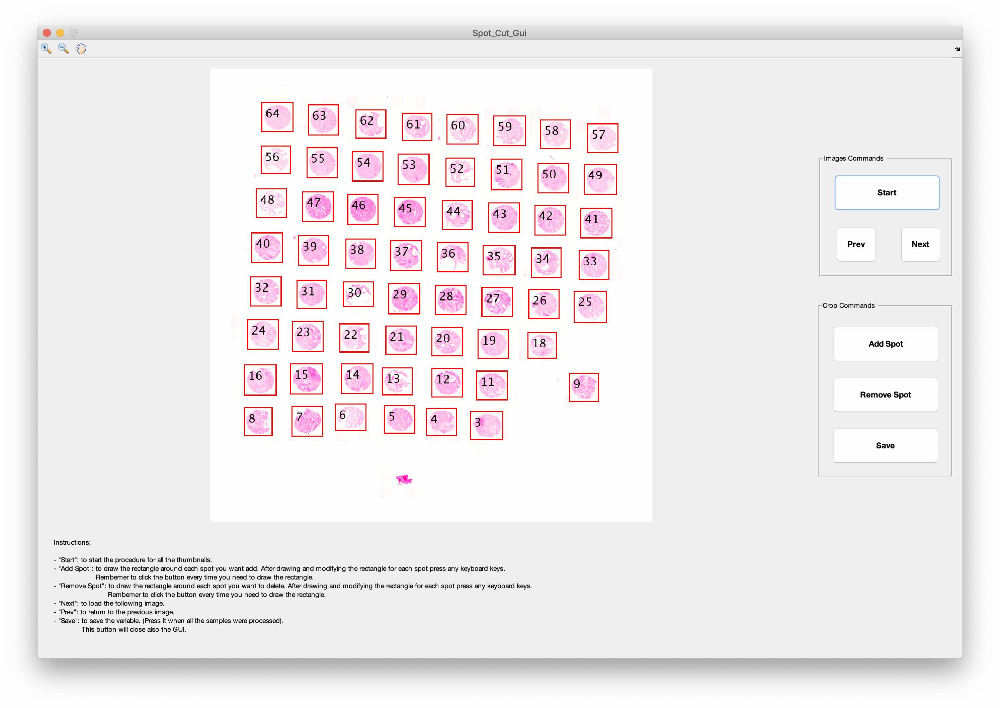

# HistoCrop

Cut ROI or TMA spots from hematoxylin and eosin (HE) mrxs-images!

### Prerequisites

What you need to install to get HistoCrop up and running:

* Matlab
* [MATLAB Engine API for Python](https://www.mathworks.com/help/matlab/matlab_external/get-started-with-matlab-engine-for-python.html)
  - Can be installed with the following commands at the matlab command prompt
  ```
  cd (fullfile(matlabroot,'extern','engines','python'))
  system('python setup.py install')
  ```
* Python3
  - openslide,os,sys,tkinter,texttable,cfonts,subprocess,csv,numpy,math,shutil,time

### Using the program

A step by step series of examples to show how to cut TMA spots out of multiple files.

Open terminal in the cropTMA folder and run `CropCode.py`.

```
cd /Users/jpohjone/Desktop/HistoCrop
python3 ./CropCode.py
```
```
██╗  ██╗ ██╗ ███████╗ ████████╗  ██████╗   ██████╗ ██████╗   ██████╗  ██████╗  
██║  ██║ ██║ ██╔════╝ ╚══██╔══╝ ██╔═══██╗ ██╔════╝ ██╔══██╗ ██╔═══██╗ ██╔══██╗
███████║ ██║ ███████╗    ██║    ██║   ██║ ██║      ██████╔╝ ██║   ██║ ██████╔╝
██╔══██║ ██║ ╚════██║    ██║    ██║   ██║ ██║      ██╔══██╗ ██║   ██║ ██╔═══╝  
██║  ██║ ██║ ███████║    ██║    ╚██████╔╝ ╚██████╗ ██║  ██║ ╚██████╔╝ ██║      
╚═╝  ╚═╝ ╚═╝ ╚══════╝    ╚═╝     ╚═════╝   ╚═════╝ ╚═╝  ╚═╝  ╚═════╝  ╚═╝      


Press R in case you want to crop a ROI from a WSIs
Press S in case you want to crop the Spots present in the TMAs
Press H in case you want to read the instructions:
```

Selecting `H` gives the help page, __which Valeria needs to update__.

Selecting `R` allows you to select a ROI from a whole slide image (WSI) and then cut it in sub-images.    

Selecting `S` allows you to extract TMA spots from a mrxs-file. Spots can be saved into patient specific folders with custom numbering if a suitable excel file is provided (specified later).

  1. After selecting `S` the program will ask for the `input` directory and an _empty_ `output` directory for the spots and summary-images.
  2. Next, the number of the rows and columns in the TMA spot matrix need to be specified. It does not matter if some of the TMA spot matrices have less rows or columns, select the maximum.
  3. [OPTIONAL] Give the folder of the excel files for patient ids and numbering. The excel file has some requirements, which stem from the standard excel outputted from some scanners.
       - __Numbering:__  Has to be specified in the _second_ sheet of the excel and match the dimensions given in the second part. All numbers must be present for spots that are actually present in the respective TMA image.
       - __Naming:__ Has to be speficied in the _third_ sheet of the excel and match the dimensions given in the second part. All spots that have the same name before an underscore (`patientID_*`) will be saved in the same folder under the respective folder for the whole TMA.
       - Name of each excel file must match the name of the mrxs-file.
  4. The program will output an image of the TMA spot matrix. If this matrix is detected in full select `Y`es. If some of the spots are not detected completely, the user has to give a new radius for the `strel()` command used in Matlab.
      * Increasing the radius will select larger area and decreasing the radius will make the area smaller. In the example below, the left side has too small radius and one spot is missed. After increasing the radius the matrix is detected correctly. It does not matter if small specs are included in the spot matrix (image on the right side) as they will be discarded later.



  5. Next the GUI will open and the user has an option to edit any spots that are not correctly detected. It is also possible to remove spots so that they will not be selected. __Carefully follow the instructions of the GUI.__



  6. After exiting the GUI the spots will be saved.
     * If the excel was provided and there were no warnings, all spots will be saved in patient specific folders.

## Authors

* **Valeria Ariotta**
* **Joona Pohjonen**

## License

This project is licensed under the MIT License - see the [LICENSE.md](LICENSE.md) file for details.
